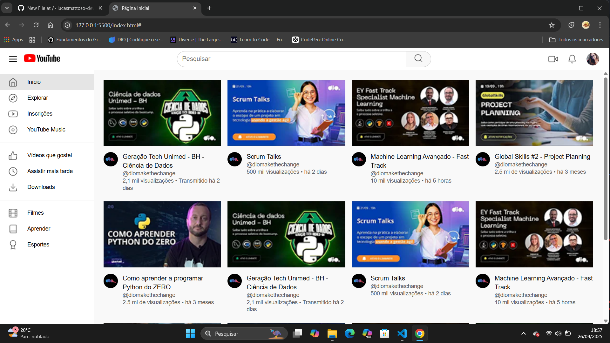

# Clone da Interface do YouTube com CSS Grid e Flexbox


> Projeto de recriação da interface da página de listagem de vídeos do YouTube, desenvolvido como um desafio de front-end para praticar e demonstrar habilidades avançadas de layout com HTML5 e CSS3.

Este projeto foca na construção de uma interface visualmente fiel à original e totalmente responsiva, utilizando técnicas modernas como CSS Grid e Flexbox.

---

### 🖼️ Screenshot do Projeto




### 🚀 Demonstração ao Vivo (Deploy)

Você pode ver o projeto em ação aqui: **[Clone da Interface do YouTube](https://lucasmattoso-dev.github.io/youtube-grid-layout/)**

---

### ✨ Funcionalidades Principais

-   **Layout Responsivo:** A interface se adapta perfeitamente a diferentes tamanhos de tela (desktop, tablet e mobile).
-   **Cabeçalho Fixo:** A barra de navegação superior permanece visível durante a rolagem da página.
-   **Sidebar Dinâmica:** O menu lateral se expande em telas maiores e se recolhe para exibir apenas ícones em telas menores, otimizando o espaço.
-   **Grade de Vídeos Flexível:** A grade de vídeos ajusta o número de colunas (de 4 para 1) conforme a largura da tela, utilizando CSS Grid.
-   **Estrutura Semântica:** Uso de tags HTML5 semânticas (`<header>`, `<main>`, `<aside>`, `<nav>`, `<section>`) para melhor acessibilidade e SEO.
-   **Estilização Fiel:** Componentes estilizados para se assemelharem ao design original do YouTube, incluindo cards de vídeo, barra de pesquisa e ícones.

---

### 🛠️ Tecnologias Utilizadas

O projeto foi construído utilizando as seguintes tecnologias:

-   **HTML5:** Para a estruturação e semântica do conteúdo.
-   **CSS3:** Para toda a estilização, layout e responsividade.
    -   **CSS Grid:** Utilizado para o layout principal da página (sidebar + conteúdo) e para a grade de vídeos.
    -   **Flexbox:** Utilizado para alinhar itens no cabeçalho, na barra de pesquisa e nos detalhes dos vídeos.
    -   **Media Queries:** Para aplicar estilos diferentes com base na largura da tela, garantindo a responsividade.

---

### 📂 Como Executar o Projeto

Como este é um projeto front-end estático, não há necessidade de instalação de dependências. Basta seguir os passos abaixo:

1.  Clone este repositório:
    ```bash
    git clone (https://github.com/lucasmattoso-dev/youtube-grid-layout.git)
    ```
2.  Navegue até o diretório do projeto.
3.  Abra o arquivo `index.html` no seu navegador de preferência.

